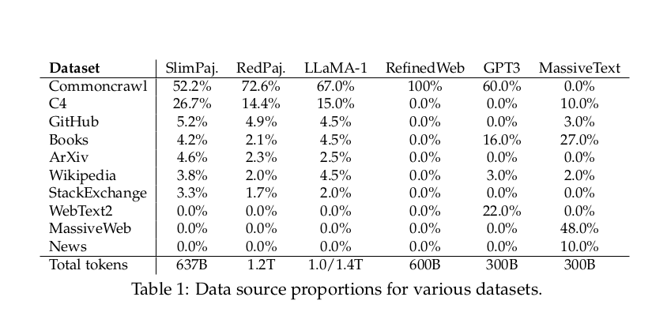
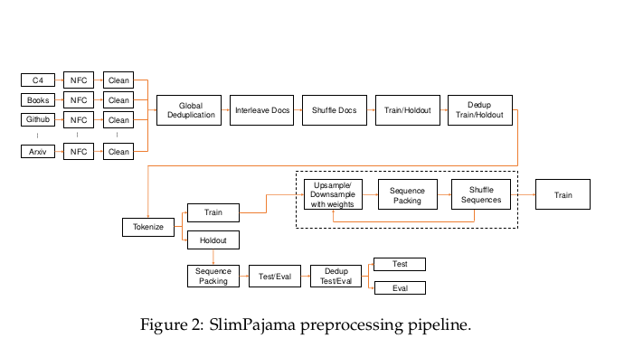

### Abstract
- Data combinations: web text, wikipedia, github, books
- De-deuplicated multi-source dataset (1.2T tokens -> Refined to 627B tokens)
- Research name = SlimPajama-DC
- Observations
	1. Global deduplication vs. local deduplication
			- Global = Across diff. sources; Local = Within single source
	2. Proportions of high-quality/highly-deduplicated multi-source datasets
- To study above,
	- Constructed 6 configs of SlimPajama
			- Train on 1.3B Cerebras-GPT model with
- Discoveries
	- Best config >>> 1.3B model trained on RedPajama (same no. of training tokens)
	- 1. Global De-duplication; 2. Increasing Data Diversity on 7B with >Batch size
- Advantages of de-duplication in general
	- Model isn't repeatedly exposed to same/similar data points - Efficient training
	- Redundant data - Slow convergence, Model overfiting.	
### In this paper
- Primary Areas in Research:
	1. Global-level & Local-level deduplication
	2. Efficacy of various combinations of thoroughly deduplicated datasets

	Reasons for 1 & 2:
	1. All sources data - No cross-domain overlaps inside
	2. To manage integ' & proportion of diverse domains

### Deduplication Concepts Explained

- **Global vs Local De-duplication**:
	- **Global**: Removes from entire combined datasets (Overlaps across sources)
	- **Local**: Removes within each individual source dataset before merging

	- In most open-source LLM training data - only local de-duplication is performed - NEGLECTING REDUDUNDANCY ACROSS DIFFERENT SOURCES

	- **CONS OF GLOBAL**: More hardware memory is naturally required by this global strategy

- **Different combinations of highly de-duplicated datasets**:
	- More likely to generalize well across various tasks
	- Data exposed to wider range of following:
		1. Vocab, syntax, semantics
		2. Cultures, beliefs, demographics
		3. Balanced and less prone to biases

- **Specialization vs Generalization Trade-off**:
	- Combining many specialised datsets -> Jack-of-all-trades model
		- While model can tackle wide range of tasks; Can't match in depth understanding like a specialised model for a particular domain

### SlimPajama Dataset Details

- Dataset Token Frequencies
	- Different datasets often highlight varied types of tokens
		- Example: GitHub prioritizing code & arXiv centering on academic content
	- KL divergence between 2 domain distributions taken
		- ??? (Read later)

### Overview of Pipeline

- SlimPajama Preprocessing pipeline
	- 

1. Low-length document filtering
	- Percentage of doc low-length filter rate: 1.86%
	- Additional global filtering: Remove short (<200 characters), low-quality documents
2. Global de-deduplication
3. Document Interleaving
4. Document Shuffling
5. Splitting into train & holdout sets
6. De-duplication of train set against holdout

Note: every step produces a transformed version of the dataset. Be sure to provision enough disk space or actively delete intermediate versions!

### Pipeline in detail

#### De-duplication:
- Tool used: http://ekzhu.com/datasketch/minhash.html + further optimizations to reduce memory consumption & increase parallelism.
- Producer-consumer schema - Parallelize I/O operations that dominate runtime
- Addtnl code changes to reduce memory utilization 
	- Keep only 1 document per set of duplicates in memory
- **Strategy used**: ==Global de-duplication== as it removes duplicates both within & between each data source
- **SIDE NOTES**: 
    - First open-sourced deduplication library written in Python to process Trillion token datasets
    - Percentage of data source bytes duplication rate: 49.6%
    - Most significant duplication found in CC & GitHub
- Algorithm used: **==MinHashLSH==**
    - **NOTE**: Vanilla implementation of MinHashLash doesn't scale to 1T token datasets like RedPajama without ==**running out of memory==**
        - Solution: 
            - ==Optimizing memory usage;== 
            - ==Parallelization to perform deduplication on 64 CPU cores with 1.4TB peak memory==
            - ==Easily decreased by creating multiple MinHashLSH objects to query==
- Multiple stages:
	1. Build MinHashLSH index
	2. Query into index to locate duplicates
	3. Build graph representation to locate connected components with duplicates
	4. Filter duplicates in each component
- Stages in detail:
    1. ***MinHash Generation***
        - Very slow process
            - **NOTE**: Recommended to be run separately before building index
        - Stages:
            - Strip, lowercase, remove punctuation, consecutive spaces, \n, \t
            - **Construct list of 13-grams**
                - Used as features to create document signature to add into MinHashLSH index
    2. ***Duplicate Pairs Generation*** - Build MinHashLSH index
        - Jaccard similarity thresold = 0.8
        - Script used: [datasketch/lsh.py](https://github.com/ekzhu/datasketch/blob/master/datasketch/lsh.py#L22)
        - This step -> 1.4TB of RAM for 1.21T tokens of RedPajama
        - In case of memory issues,
            - Split LSH object into multiple buckets to reduce memory consumption
        - NOTE: total number of processes that will be created is <n_processes> + <bands>
       3. ***Duplicate Graph Construction & Search for Connected Components***
        - Find connected components containing docs that are duplicate with each other
        - **Constructs a graph** from document pairs
        - Example: 
            - Pairs: (A, B), (A, C), (A, E)
            - Forms cluster: (A, B, C, E)  [only one doc from each pair]
        - Toolkit: 
            - Evaluated the performance and memory consumption of `networkx`, `graphtool`, and `networkit`. 
            - `networkit` offered most efficient implementation as it is designed to work with large graphs and features great parallelism.
      4. ***Generate Final List of Duplicates***
        - Process connected components & **create lookup table** to filter duplicates later

